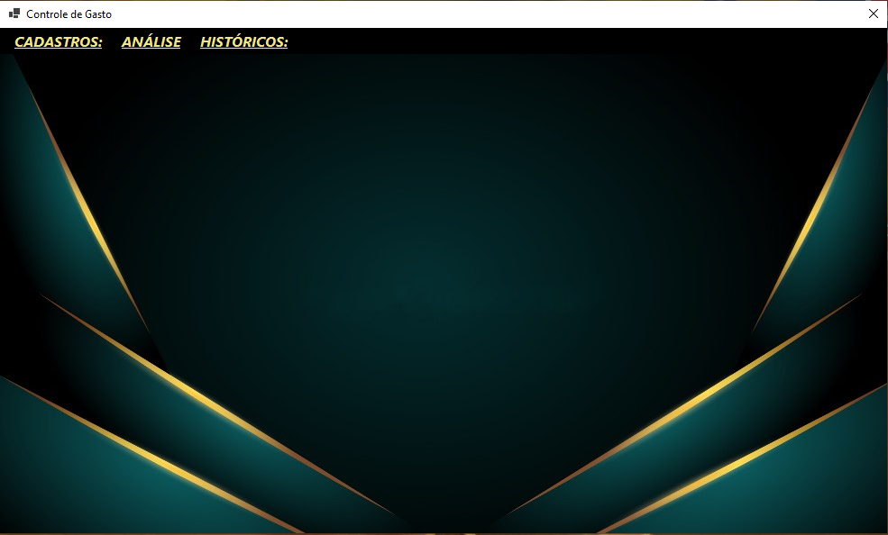

<h1 align="center">Sistema Controle de Gasto</h1>

Esse projeto foi desenvolvido para aplicar meus conhecimentos que estou aprendendo.
  

  <a href="#tecnologias">Tecnologias</a>&nbsp;&nbsp;&nbsp;|&nbsp;&nbsp;&nbsp;
  <a href="#projeto">Projeto</a>

  

## 💻Tecnologias

Esse projeto foi desenvolvido com as seguintes tecnologias:

- C#
- SQL Server
- Visual Studio

## 📂Projeto

Esse é um projeto do curso que estou fazendo no SENAC - SP. 
O sistema tem como função cadastrar pessoas, receitas e despesas. 
Conta também com uma área para realizar uma analise das informações cadastradas.
O projeto não esta pronto. Falta tratar algumas exceções e implemantar algumas funcionalidades.
